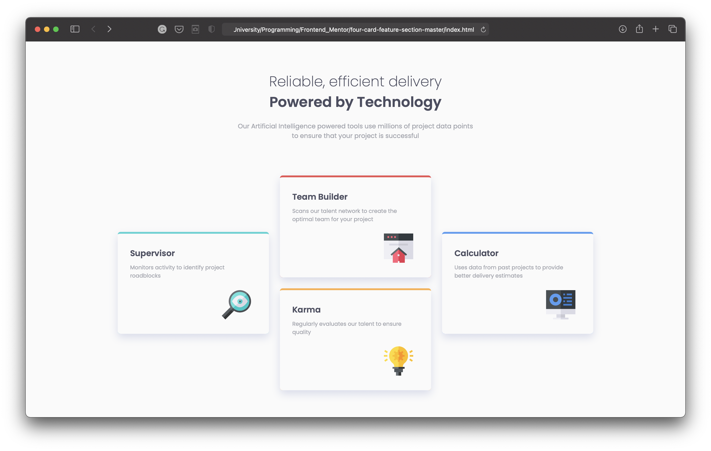

# Frontend Mentor - Four card feature p solution

This is a solution to the [Four card feature challenge on Frontend Mentor](https://www.frontendmentor.io/challenges/four-card-feature-p-weK1eFYK). 

## Overview

### The challenge

The challenge is to build out this feature and get it looking as close to the design as possible.
For detailed design see [here](./design/) and [style-guide.md](./style-guide.md)

Users should be able to:

- View the optimal layout for the site depending on their device's screen size

### Screenshot

### Links

- Solution URL: [https://linarietuma.github.io/four-card-feature-section/](https://linarietuma.github.io/four-card-feature-section/)

### Built with

- Semantic HTML5 markup
- CSS custom properties
- Flexbox
- CSS Bootstrap